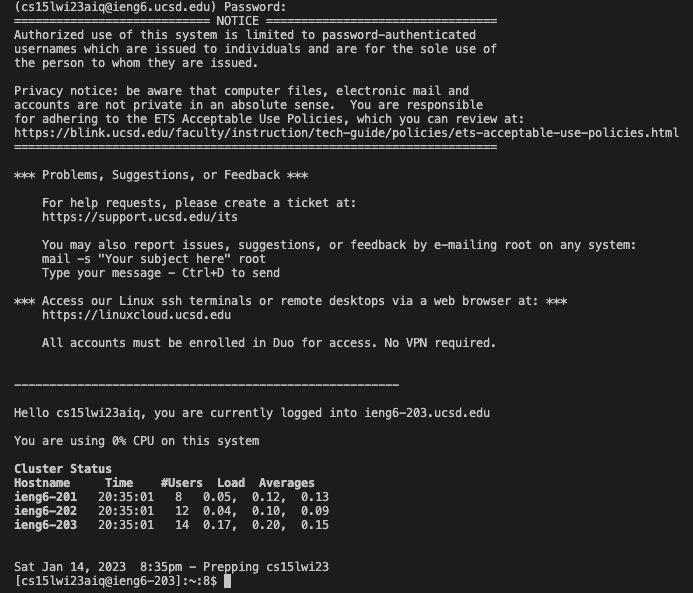
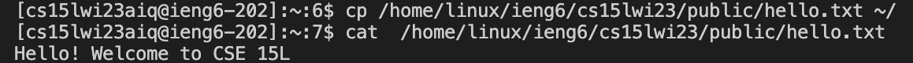

# Lab Report 1 - Remote Access and FileSystem (Week 1)

## How to log into a course-specific account on `ieng6`

<br>

## 1. Installing VScode

In order to follow this blog post, we will be using Visual Studio Code. Visual Studio Code can be downloaded here: [https://code.visualstudio.com/](https://code.visualstudio.com/).

After installing, this window should appear:


## 2. Remotely Connecting

To connect to our remote server, we will open the terminal in Visual Studio Code (using **Ctrl/Command + `**).

Since I am not on Windows, I do not need to install `git`. Type this command to connect to the server:
```
ssh cs15lwi23aiq@ieng6.ucsd.edu
``` 
**Note that `aiq` is a unique string of characters that corresponds to my account.**

When first connecting to the server, you will receive a message asking you if you want to continue connecting. Type `yes`.

Type in your password when prompted. You will be unable to see your password while doing so.

When you log in, you will see this appear in the terminal:



This means that you have successfully connected and can run commands on the remote server.

## 3. Trying Some Commands
To get started, let's try out a few commands:
```
ls -a
```
This lists out all files (including hidden files).

In order to copy a file from a remote server and read it, type:
```
cp /home/linux/ieng6/cs15lwi23/public/hello.txt ~/
cat /home/linux/ieng6/cs15lwi23/public/hello.txt
```
The `cp` command is used to copy the file, while the `cat` command reads the file.

After executing these commands, this should appear in the terminal:

