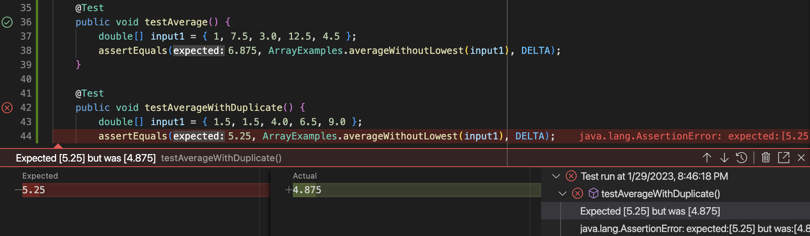

# Lab Report 2 - Servers and Bugs (Week 3)

## Part 1

Here is the code I wrote for a web server, `StringServer`. This web server allows users to add a message to the main page when providing a specified path and query.


In order to run this web server, I compiled StringServer.java and ran it on
port 3000:


<br>

**Two** screenshots are provided below in order to demonstrate how the server works:

**Example 1 (request and main page shown below):**


- When the web server receives `/add-message?s=Hi everyone!`, `handleRequest()` is called, which runs `getPath()`, `getQuery()`, and `.equals()` to determine what the user wants to execute. The server also uses `split()` to read what was passed into the query.

- In `handleRequest()`, the URL gets passed as an argument. The `split()` method returns an array which is split into elements using the equal sign, which is assigned to `parameters`. The first element in `parameters` is then added onto the `message` variable.

- The value of `url` is assigned to the new request.

- The `parameters` variable is assigned to `["s", "Hi everyone!"]`. 

- The `message` variable changes from `""` to `"Hi everyone!\n"`.

<br>

**Example 2 (request and main page shown below):**


- When the web server receives `/add-message?s=Hello there!`, `handleRequest()` is called, which runs `getPath()`, `getQuery()`, and `.equals()` to determine what the user wants to execute. The server also uses `split()` to read what was passed into the query.

- In `handleRequest()`, the URL gets passed as a **new** argument. The `split()` method returns an array which is split into elements using the equal sign, which is assigned to `parameters`. The first element in `parameters` is then added onto the `message` variable, **on top of the old request**.

- The value of `url` is assigned to the new request.

- The `parameters` variable is assigned to `["s", "Hello there!"]`. 

- The `message` variable changes from `"Hi everyone!\n"` to `"Hi everyone!\nHello there!\n"`.

<br>

## Part 2
## Failure-inducing input:
**JUnit test:**
```
@Test
public void testAverageWithDuplicate() {
    double[] input1 = { 1.5, 1.5, 4.0, 6.5, 9.0 };
    assertEquals(5.25, ArrayExamples.averageWithoutLowest(input1), DELTA);
}
```

- This test fails because it does not account for arrays that have multiple occurrences of the lowest number.

<br>

## Input that doesn't induce a failure:
**JUnit test:**
```
@Test
public void testAverage() {
    double[] input1 = { 1, 7.5, 3.0, 12.5, 4.5 };
    assertEquals(6.875, ArrayExamples.averageWithoutLowest(input1), DELTA);
}
```
- This test passes because there is no duplicate lowest number in the array, and the program functions correctly.

<br>

## The symptom:


- The symptom is that the program will only be able to output the correct value when the lowest number is present once (first test). 
- If the lowest number is present more than once, the output is incorrect as it subtracts the lowest number multiple times from the sum, rather than just once (second test).

<br>

## The bug:
### The buggy program (before):
```
static double averageWithoutLowest(double[] arr) {
    if (arr.length < 2) { return 0.0; }
    double lowest = arr[0];
    for (double num : arr) {
        if (num < lowest) { lowest = num; }
    }
    double sum = 0;
    for (double num : arr) {
        if (num != lowest) { sum += num; }
    }
    return sum / (arr.length - 1);
}
```
### The fixed program (after):
```
static double averageWithoutLowest(double[] arr) {
    if (arr.length < 2) return 0.0;
    double lowest = arr[0];
    double sum = 0;

    for (double num : arr) {
        if (num < lowest) lowest = num; 
        sum += num;
    }

    // Delete the lowest from the sum
    sum -= lowest;
    return sum / (arr.length - 1);
}
```
- The main bug stems from the if-statement `if (num != lowest)` because it allows a duplicate of the lowest number to be excluded into the sum.
- The method is fixed by deleting this if-statement entirely and using one for-loop to sum up every element in the array. After the for-loop, `lowest` is subtracted from the sum. This ensures that the lowest number is only excluded once.

<br>

## Part 3

In lab 2, I learned how to set up a web server and handle requests from users. While I was initially unsure of how to use the path and parameters from the query in my program, I am now able to use `getPath()`, `getQuery()`, and `split()` to obtain parameters from the query and execute different parts of my code. I also learned that when a web server is hosted and deployed, fields and variables in the program can be manipulated by different users who are on the same URL.
