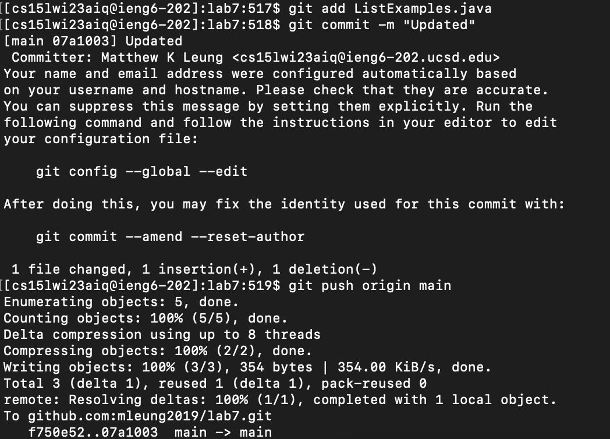

# Lab Report 4 - CLDQ (Week 7)

## 4. Log into ieng6

Command(s) used: 
```
ssh cs15lwi23aiq@ieng6.ucsd.edu
```


### **Keys pressed:** `<Ctrl + R>ssh<enter>`

### **Explanation:** To log into my account without having to remember the login and password, I used `<Ctrl + R>` and typed `ssh` to search for my earlier command, `ssh cs15lwi23aiq@ieng6.ucsd.edu`. After pressing `<enter>`, I was able to log in without using my password, as I generated and authorized an SSH key for ieng6.

<br>

## 5. Clone your fork of the repository from your GitHub account

Command(s) used: 
```
git clone git@github.com:mleung2019/lab7.git
```


### **Keys pressed:** `git clone <left click><Command + V><enter>`

### **Explanation:** To clone the repository, I used an SSH clone URL provided from GitHub. I typed `git clone ` and used `<left click` to add the clone URL from GitHub to my clipboard. Then, I used `<Command + V>` in order to paste this clone URL from my clipboard into the terminal. I then pressed `<enter>` to finish the command.  

<br>

## 6. Run the tests, demonstrating that they fail

Command(s) used: 
```
cd lab7/
javac -cp .:lib/hamcrest-core-1.3.jar:lib/junit-4.13.2.jar *.java
java -cp .:lib/hamcrest-core-1.3.jar:lib/junit-4.13.2.jar org.junit.runner.JUnitCore ListExamplesTests
```


### **Keys pressed:** `cd l<tab><enter><Ctrl + R>javac<enter><Ctrl + R>java <enter>`

### **Explanation:** To run the tests, I first had to `cd` into the repository, where I typed `cd l` and used `<tab><enter>` to autocomplete the path and finish the command. Then, I typed out another command to compile the java files, where I used `<Ctrl + R>javac<enter>` to access my old command, `javac -cp .:lib/hamcrest-core-1.3.jar:lib/junit-4.13.2.jar *.java`. Similarly, to run the tests, I used `<Ctrl + R>java <enter>` to access another old command, `java -cp .:lib/hamcrest-core-1.3.jar:lib/junit-4.13.2.jar org.junit.runner.JUnitCore ListExamplesTests`. After executing these commands, we can see that the JUnit tests failed.

<br>

## 7. Edit the code file to fix the failing test

Command(s) used:
```
nano ListExamples.java
```


### **Keys pressed:** `nano L<tab>.java<enter><Ctrl + W>(index 2 <<enter><down><down><right><right><right><backspace>2<Ctrl + O><enter><Ctrl + X>`

### **Explanation:** In order to edit the code file in the terminal, I typed `nano L<tab>`, which autocorrected to `nano ListExamples`, where I fully completed the command by doing `.java<enter>`. Now that I was in the nano text editor, I used `<Ctrl + W>(index 2 <<enter>` to search for the substring "(index 2 <" and jump to this in the editor. I then used the down arrow and right arrow to get to the bug in the code and used `<backspace>2` to fix the bug (change index1 to index2). To save the edits, I used `<Ctrl + O><enter>` to save these changes to the code file. Finally, to exit nano, I used `<Ctrl + X>`.

<br>

## 8. Run the tests, demonstrating that they now succeed

Command(s) used:
```
javac -cp .:lib/hamcrest-core-1.3.jar:lib/junit-4.13.2.jar *.java
java -cp .:lib/hamcrest-core-1.3.jar:lib/junit-4.13.2.jar org.junit.runner.JUnitCore ListExamplesTests
```


### **Keys pressed:** `<up><up><up><enter><up><up><up><enter>`

### **Explanation:** To run the tests again, I recompiled the java files by pressing the up arrow 3 times to access the command `javac -cp .:lib/hamcrest-core-1.3.jar:lib/junit-4.13.2.jar *.java` in my command history and pressing `<enter>`. Then, I ran the tests by pressing the up arrow 3 times again to access the command `java -cp .:lib/hamcrest-core-1.3.jar:lib/junit-4.13.2.jar org.junit.runner.JUnitCore ListExamplesTests` in my history and pressing `<enter>` again. From the JUnit output, we can see that these tests pass now. 

<br>

## 9. Commit and push the resulting change to your GitHub account (you can pick any commit message!)

Command(s) used:
```
git add ListExamples.java
git commit -m "Updated"     
git push origin main 
```




### **Keys pressed:** `git add L<tab>.java<enter>git commit -m "Updated"<enter>git push o<tab>m<tab><enter>`

### **Explanation:** To commit and push the resulting changes, I first added my changes by using `git add L<tab>`, which autocorrected to `git add ListExamples` and finished the command by typing `.java<enter>`. I then typed `git commit -m "Updated"` to commit the changes and set the commit message to `Updated`. Finally, to push the changes to GitHub, I used `git push o<tab>m<tab><enter>`, where `o<tab>` autocorrected to `origin` and `m<tab>` autocorrected to `main`.
