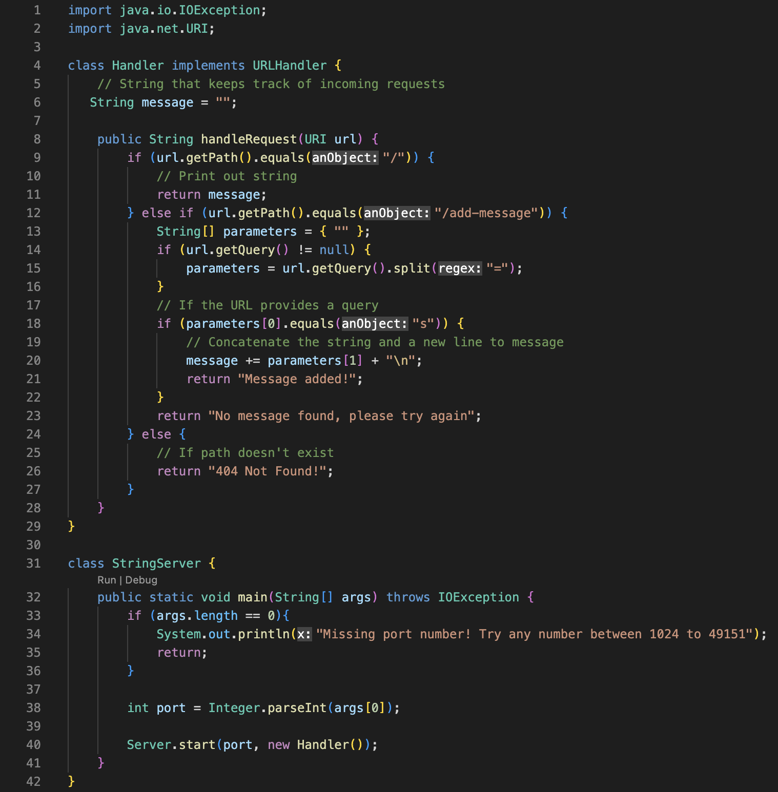

# Lab Report 5 - Putting It All Together (Week 9)

## Using `jdb` And Revisiting StringServer (Lab Report 2)
`jdb` is a Java debugger that allows users to take a closer look at the values of variables, fields, and arguments in a program. You can set breakpoints to analyze how these values change at different times.

## Finding the Values of Variables
Here is the code I wrote for the web server, `StringServer`. By using the path `/add-message`, you can specify a query to add to `message`, which is stored on the web server:



In this program, the relevant variables are:
* `url`, which is the URL that gets passed as an **argument** in `handleRequest()`
* `parameters`, which is an array that splits the URL's query into elements by the equal sign (**variable**)
* `message`, which is a **field** that records and saves data from incoming requests

After identifying what variables, fields, and arguments we want to track, we can now use `jdb` to keep track of their values at a specific breakpoint. Since I am tracking how the values change after adding a message, I am putting a breakpoint at **line 21**, which is when `handleRequest()`'s return statement runs.

<br>

## 1. Starting `jdb`

To start using `jdb`, I used these commands:


```
javac -g StringServer.java Server.java
jdb StringServer
stop at Handler:21
run StringServer 3000
```
* The first command is run to compile the necessary files. The `-g` flag is used to provide the debugger information.
* The second command starts `jdb`.
* The third command sets the breakpoint to line 21, which is in the Handler class.
* The fourth command starts the web server on port 3000.

<br>

## 2. Making a Web Request and Hitting the Breakpoint
I made a web request to add to the message using:
```
http://localhost:3000/add-message?s=Hi%20everyone!
```


This resulted in the breakpoint being hit.

<br>

## 3. Analyzing Variables
By using the `print` command, we can print the current value of a variable at the breakpoint. `dump` is also used to print the contents of an object. We can now find the values of the program's variables.


### Variable values:
* `url = "/add-message?s=Hi%20everyone!"`
* `parameters = { "s", "Hi everyone!" }`
* `message = "Hi everyone!\n"`

<br>

## 4. Continuing From Breakpoint 
We can continue the program after the program by using `cont` and making a new web request using:
```
localhost:3000/add-message?s=Hello%20there!
```


The breakpoint is hit again and we can use `print` and `dump` again to see how the values change:


### Variable values:
* `url = "/add-message?s=Hello%20there!"`
* `parameters = { "s", "Hello there!" }`
* `message = "Hi everyone!\nHello there!\n"`

<br>

## Significance:
Instead of using `System.out.println()` to analyze the value of variables, `jdb` offers a much more flexible solution that uses breakpoints to examine parts of a program. For complex programs with many variables that frequently change values, `jdb` gives us an efficient and systematic way to debug Java code.
